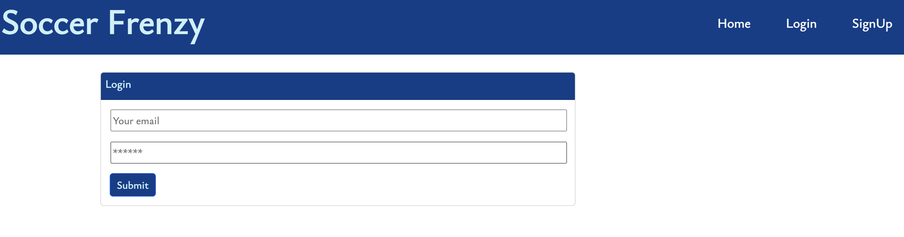
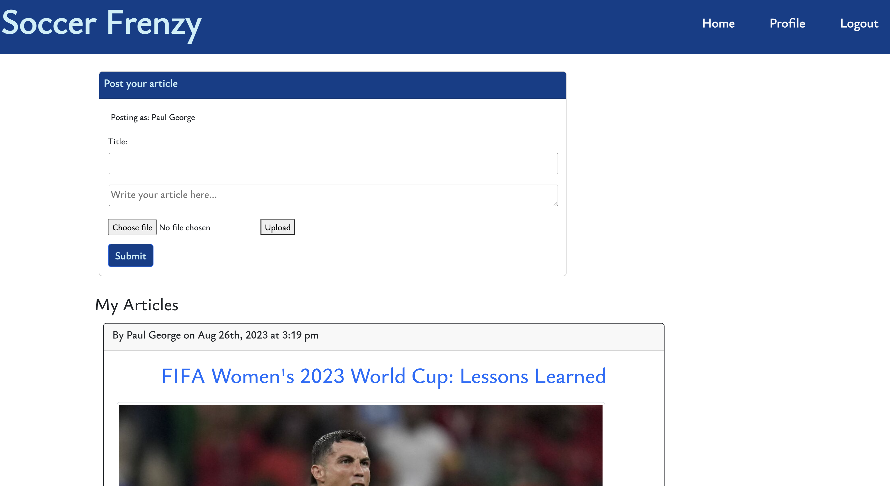

# **Soccer Frenzy** 
[](https://opensource.org/licenses/MIT)
## Project Description
Soccer Frenzy is a blog for lovers of the beautiful game to post articles, share their thoughts and opinions on everything Soccer! It allows soccer enthusiasts to sign-up or login (for existing users) and post soccer-related articles. Users will be able to comment on articles posted by other users, and they would also have followers.

The project was developed based on the MERN stack framework using several Code libraries and packages. The front-end was developed using *React*, including the *React-Router*. The backend was developed using *GraphQL* with a *Node.js* and *Express*.js server. For the database, the project utilized *MongoDB* and the *Mongoose ODM*. Other packages utilized include `bcrypt`, `JWT`, `dotenv`, `jsonwebtoken`, `apollo-server-express` e.t.c. CSS was based mostly on *Bootstrap 5*, including *Bootstrap Icons*.


## Link to Webpage
Click [here](https://glacial-plateau-12888-cbb958ef2bae.herokuapp.com/) to view the application
## Table of Contents
- [User Story](#user-story)
- [Acceptance Criteria](#acceptance-criteria)
- [Usage](#usage)
- [License](#license)
- [Tests](#tests)

## User Story

```
As a Soccer Fan,
I want to share opinions on all things soccer with fellow enthusiasts
So that I can build a huge followership and community of soccer lovers,

I want to post articles on various aspects of the game
So that other users can read these articles and share their thoughts.

```

## Acceptance Criteria
```
WHEN I open the web application,
THEN the home page should display a Navigation bar which includes a "Header" with menu options "Home", "Profile", "Login" and "Signup"

WHEN I click on "Login" or "Signup",
THEN I am taken to separate routes that display a login form or Signup form

WHEN I login as an existing user or Signup as a first-time user,
THEN I am taken to the home page, with the "Logout" menu option displayed in the navbar.

WHEN I click on the title of an article, 
THEN the article is displayed with accompanying comments from other users including a comment form.

WHEN I complete the comment form,
THEN my comment is displayed together with other comments by other users.

WHEN I click on the "Profile" menu option,
THEN I am taken to my own profile dashboard with a form to create a new article and the list of my own articles.

WHEN I complete the form to create a new article, 
THEN this article is displayed on the application's home page and my profile page.

WHEN I am not logged in and I click on the title of an article,
THEN I am prompted to log in to read the article
```


## Usage
First time users have access to the home page to view the latest articles but will need to sign-up to read the articles. Upon login, users are directed to the Home Page with the latest articles published displayed on the home page, including the author, headline and date the article was posted. 


You can login:



And post your article...




## Credits
Web app developed by Kanayochi Ifediora, with support from Bootcamp Instructors, Tutors and Youtube videos

## License
This project is licensed under the MIT license.

## Questions
Any questions? please contact me via e-mail at anayoifediora@live.com

- [Github username](https://github.com/anayoifediora)
- [Project Github Repo](https://github.com/anayoifediora/Soccer-Frenzy)